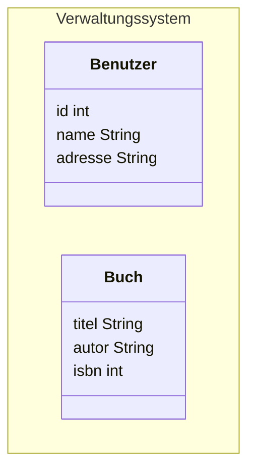

# Beispiel: Identifikation von Klassen und Attributen
🔗 [[SAE - VL04 - Klassendiagramm.pdf#page=10&selection=5,0,5,51|SAE - VL04 - Klassendiagramm, p.10]]

```mermaid
classDiagram

namespace Verwaltungssystem{

class Benutzer{

id int

name String

adresse String

  

}

class Buch{

titel String

autor String

isbn int

}

}
```
